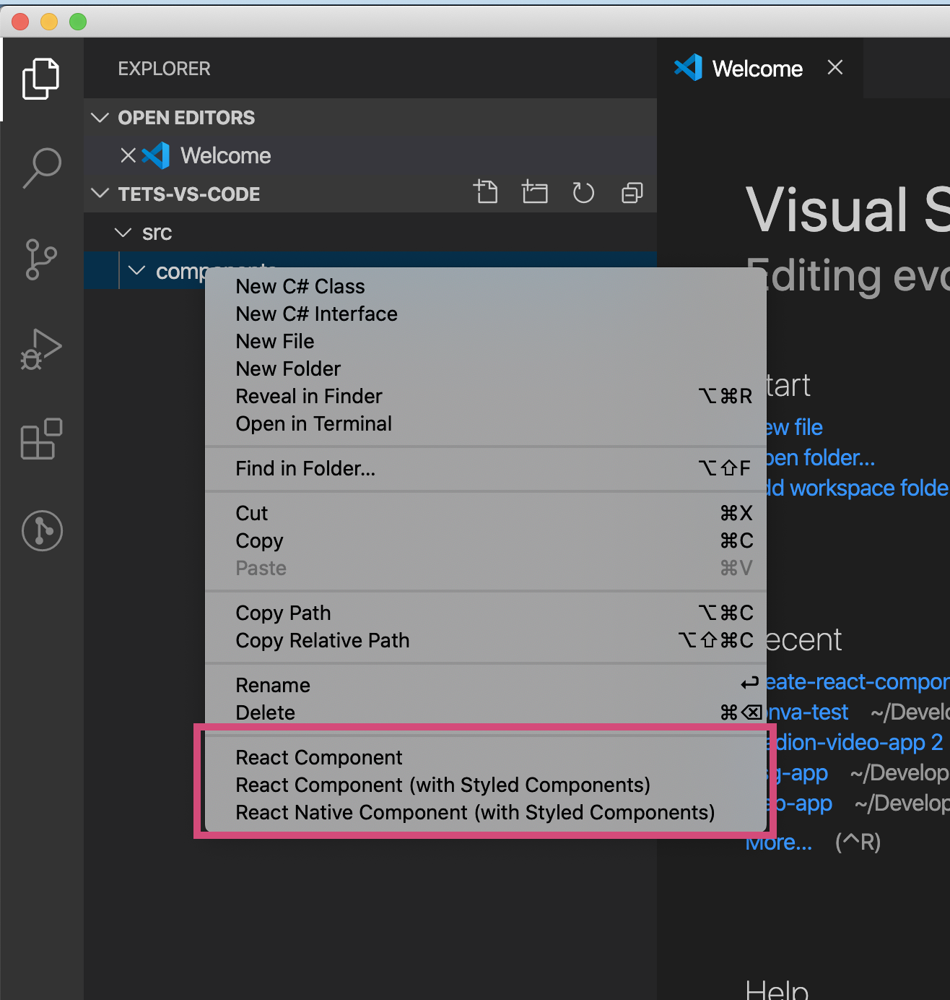
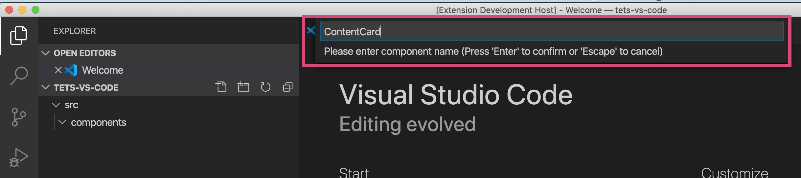
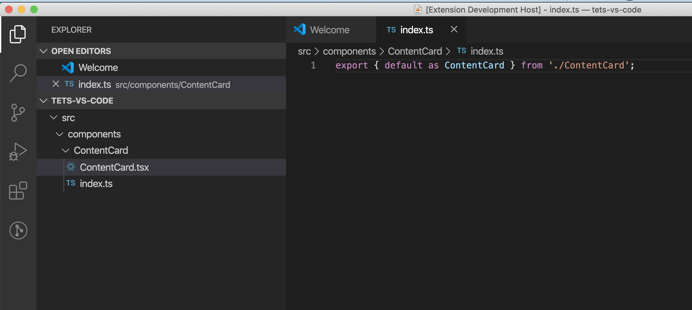

# Create React Component

Opinionated React component folder/file creation.

_TODO:_ Add story book and test templates.

## 1. Right click on a folder

## 2. Enter a name

## 3. Folder structure is created

# To Publish

https://code.visualstudio.com/api/working-with-extensions/publishing-extension
Follow that but drag the VISX file to the web console rather than publish from CLI.
